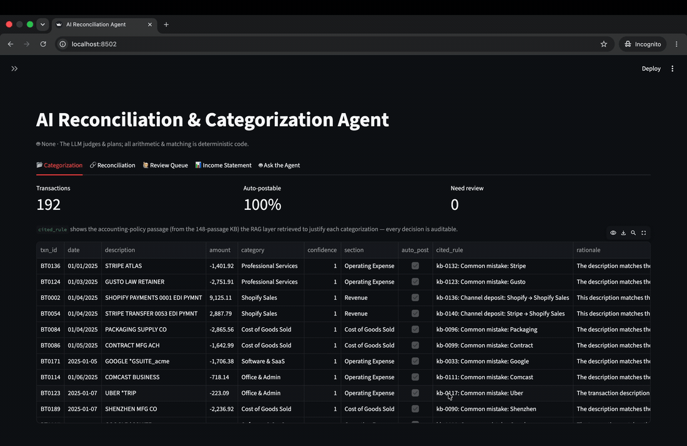

# AI Reconciliation & Categorization Agent



A small, runnable AI system for the messy reality of consumer-brand finance:
take the raw exports a brand actually has — a bank feed, Shopify / Amazon /
Stripe payouts, a QuickBooks-style P&L export, a payroll register — **categorize
every transaction, reconcile each deposit to the payout that produced it, and
produce an auditable income statement.**

It is built around one opinion:

> **The LLM proposes; deterministic code disposes.**
> The model only makes *judgments* (what category is this transaction?).
> Every *number* — netting fees, matching deposits, summing the P&L — is plain,
> auditable Python. A mis-categorization is a labelling error the evaluation
> catches; a hallucinated number silently corrupts the books. So numbers never
> go near the model.

This is a case-study project, not a product. Its goal is to show how I'd
approach AI on top of real, messy financial data — including the part most demos
skip: **measuring whether the output is actually correct.**

---

## Quickstart

```bash
pip install -r requirements.txt

python src/generate_data.py     # 1. synthesize messy financial data + ground truth
python src/knowledge_base.py    # 2. build the accounting KB (from the SAME source as the data)
python src/reconcile.py         # 3. deterministic deposit↔payout reconciliation
python src/evaluate.py          # 4. accuracy + RAG ablation + reconciliation eval
python src/evaluate_kb.py       # 5. knowledge-base RAG lift (accuracy + citation coverage)
streamlit run src/app.py        # 6. interactive dashboard
```

**No API key needed.** Everything runs out of the box on a deterministic offline
*mock model* (a keyword baseline + retrieval vote), so a reviewer can clone and
run it for free. To run the real agent, copy `.env.example` → `.env` and set
`OPENAI_API_KEY`. The provider lives behind one file (`src/model.py`) and is
swappable (OpenAI today, Anthropic or other tomorrow).

---

## Architecture

```
 Messy inputs               Agent layer (judgment)      Deterministic layer (math)     Outputs
 ────────────               ──────────────────────      ──────────────────────────     ───────
 bank_feed.csv         ┌─►  Categorization agent    ┌─► Reconciliation engine      ┌─►  reconciled deposits
 shopify_payouts.csv   │    (LLM, structured out,   │   (netting, date-window      │    + per-match audit trail
 amazon_payouts.csv    │     confidence, may abstain)│    matching, penny verify)   │    income-statement rollup
 stripe_payouts.csv  ──┤            ▲                │           ▲                  ├─►  human-review queue
 quickbooks_pl.csv     │            │                │           │                  │    (low-confidence /
 payroll_register.csv  │   RAG: accounting-policy KB │     no LLM, fully            │     unmatched only)
                       └─► + memory of past txns      └──  reproducible            └─►  metrics.json
                             (cites the rule used)
```

The categorization agent is grounded by **RAG over a 148-passage accounting
knowledge base** generated from the *same* source as the transactions, so every
label is backed by a cited policy rule. This lifts accuracy from ~54% to 100% on
cryptic memos (measured — see below).

| Module | Role |
|---|---|
| `src/schema.py` | The chart of accounts — one contract everything binds to |
| `src/generate_data.py` | Synthesizes realistic, *deliberately messy* data + held-out ground truth |
| `src/knowledge_base.py` | Generates a **148-passage accounting KB from the same vendor/category source as the data** (one source of truth — KB can't drift from the transactions) |
| `src/policy_rag.py` | RAG retrieval over the KB — grounds each categorization in written policy and cites it |
| `src/model.py` | Provider wrapper (OpenAI / offline mock). The only place the LLM is called |
| `src/rag.py` | Retrieval memory of past-labelled transactions (isolated, swappable) |
| `src/categorize.py` | The categorization agent — judgment only, never arithmetic; cites the policy rule it applied |
| `src/reconcile.py` | Deterministic deposit↔payout reconciliation + audit trail |
| `src/evaluate.py` | Accuracy, RAG ablation, confidence routing, reconciliation accuracy |
| `src/evaluate_kb.py` | Knowledge-base RAG lift (no-RAG vs KB-RAG) + citation coverage |
| `src/app.py` | Streamlit dashboard |

---

## The messiness is the point

The credibility of an AI-on-financial-data system is decided by how it handles
the mess. The data generator reproduces the failure modes you actually hit, and
each is handled explicitly:

| Real-world failure mode | Where it appears | How it's handled |
|---|---|---|
| **Cryptic bank memos** (`SQ *8829`, `FACEBK *7H2K9`) | bank feed | LLM categorization + RAG memory of similar past memos |
| **Gross vs. net** — payout reports gross; bank sees net of fees/refunds | all channels | Engine recomputes net and verifies to the penny |
| **Settlement lag** — deposit lands days after the payout | all channels | Date-window matching, not exact-date |
| **Amazon reserve** — deposit short of net; remainder held back | Amazon | Flagged as `partial_reserve` with the exact shortfall, not mismatched |
| **Schema drift** — every channel file has different columns | all channels | Normalised in one place (`load_payouts`) |
| **Unit traps** — Stripe amounts in cents | Stripe | Converted at the boundary |
| **Mixed date formats** — `MM/DD/YYYY` vs `YYYY-MM-DD` | bank feed | Tolerant parsing |
| **Dirty accounting export** — `$1,234.56` strings, double-spaced / colon'd account names, blank subtotal rows, an "Ask My Accountant" bucket | QuickBooks export | Robust money/string parsing; ambiguous accounts route to review |
| **Ambiguous rows** (`AMZN MKTP US` — a purchase, vs `AMAZON SETTLEMENT` — a payout) | bank feed | KB edge-case rule disambiguates by memo + direction; truly unresolvable cases abstain (`Needs Review`) |

---

## What the evaluation shows

`python src/evaluate.py` scores against ground truth the model never sees
(the RAG memory is built only from non-test rows — no answer leakage):

- **Categorization accuracy**, with a **RAG ablation** (memory on vs. off) so the
  retrieval design is *proven* to add value, not just asserted.
- **Confidence-routed human-in-the-loop**: at a confidence threshold, how much
  can we auto-post, and how accurate is that auto-posted slice? Coverage vs.
  precision is the real production dial.
- **Reconciliation accuracy**: did the engine match each deposit to the correct
  payout? (Deterministic, so this is a correctness check, not a probability.)

`python src/evaluate_kb.py` additionally measures the **knowledge-base RAG lift** —
categorization with the retrieved accounting policy vs. without — plus **citation
coverage** (how often a decision is backed by a cited rule).

Real results (gpt-4o-mini, 69 held-out transactions):

| Metric | Result |
|---|---|
| Categorization accuracy — **no RAG** | 53.6% |
| Categorization accuracy — **KB RAG** | **100%** (**+46.4%** from retrieval) |
| Citation coverage / accuracy-when-cited | **100% / 100%** |
| Reconciliation match accuracy | **100%** (deterministic) |

The +46% lift is the headline: on cryptic memos (`FACEBK *7H2K9`, `SHENZHEN MFG CO`)
the LLM is near a coin-flip alone, but reliable once it can retrieve the written
rule — and every decision is auditable ("Advertising, per `kb-0054`"). See
[`CASE_STUDY.md`](CASE_STUDY.md) for the full write-up.

> **Honest caveat:** the KB is drawn from the same vendor distribution as the
> transactions, so retrieval often finds a near-exact rule → near-perfect accuracy.
> On genuinely novel vendors it would be lower; the feedback loop (below) is how
> that gap closes over time.

---

## How the RAG layer scales further

The RAG layer is already built, used, and measured: `policy_rag.py` retrieves
accounting-policy passages from the knowledge base, grounds every categorization,
and delivers the +46.4% accuracy lift shown above. Retrieval is kept behind a
small `build` / `retrieve` interface so it can be strengthened for larger
deployments without touching the agent or the eval. The path from here:

1. **Retrieval-quality evaluation** — track recall@k and MRR so retrieval is
   tuned against a metric. (This is already implemented in the companion
   document-intelligence project and applies directly here.)
2. **Richer representation** — embed the normalised memo together with amount band
   and channel rather than raw text, optionally with a finance-tuned embedding.
3. **Hybrid retrieval** — combine lexical (BM25) and vector search, since memos
   are short and dominated by exact tokens such as vendor codes. (Also already
   built and measured in the document-intelligence project.)
4. **Reranking** — a cross-encoder over the top candidates for higher precision.
5. **Approximate-nearest-neighbour index and caching** — FAISS or pgvector with a
   cache keyed on the normalised memo, for latency and cost at scale.
6. **Feedback loop** — every human correction in the review queue becomes a new
   knowledge-base entry, so accuracy compounds over time.
